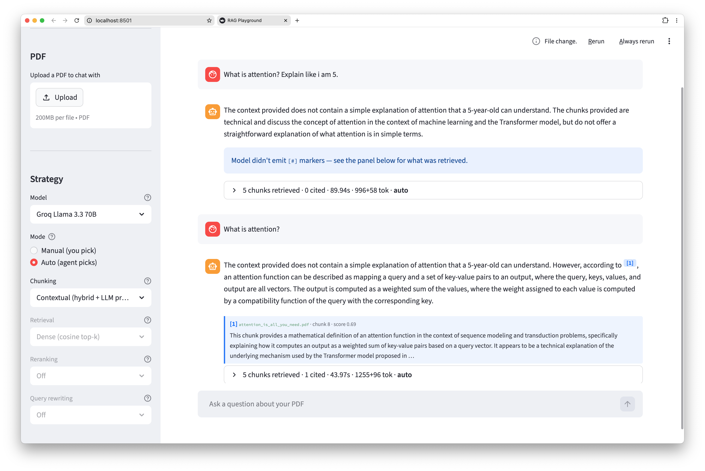

> A playground for experimenting with Retrieval-Augmented Generation (RAG) techniques.

[Live demo](https://rag-playground-civiks.streamlit.app/)



## Run

Python 3.13 + [uv](https://docs.astral.sh/uv/getting-started/installation/).

```bash
make install                # uv sync
cp .env.example .env        # add GOOGLE_API_KEY
make ingest                 # only if you drop new PDFs into corpus/
make phoenix &              # optional, trace UI on :6006
make app                    # http://localhost:8501
```

Two PDFs are pre-loaded and the Qdrant index ships with the repo, so `make app` works out of the box. `make help` lists the rest.

## Build log

1. **Naive RAG.** Docling → 1200-char chunks → BGE embeddings → Qdrant cosine top-5 → Gemini. Baseline.
2. **Eval harness.** RAGAS over `evals/eval_questions.json` — faithfulness, answer relevancy, context precision.
3. **Layout-aware chunking.** Docling `HybridChunker` respects headings and keeps tables intact. (`rag_docling_hybrid`)
4. **Hybrid retrieval.** BM25 + dense vectors fused with Reciprocal Rank Fusion (k=60).
5. **Cross-encoder rerank.** Retrieve top-20, rerank with `bge-reranker-v2-m3`, keep top-5.
6. **Query rewriting.** HyDE (LLM writes a hypothetical answer, embeds *that*) and multi-query (3 paraphrases, union).
7. **Multi-provider LLM.** Gemini, Groq, Ollama via `provider:model_id` dispatch. Streaming for all three.
8. **Adaptive auto mode.** Three patterns from the literature:
    - **Adaptive RAG** — `classify_query` picks retrieval / rerank / rewrite from question shape.
    - **CRAG-style correction** — `assess_retrieval` gates on top score, retries with a stronger strategy.
    - **Self-RAG-style reflection** — `reflect_on_answer` critiques final-answer faithfulness.

    Every decision is its own Phoenix span.
9. **Contextual retrieval.** LLM-generated preamble per chunk, prepended before embedding. (`rag_contextual`)
10. **Semantic chunking.** Split where consecutive sentence embeddings drop in cosine (topic-shift).
11. **Parent-child retrieval.** Index small children (~300 char), return the larger parent (~1200 char) to the LLM.
12. **PDF upload.** Drag-and-drop, in-memory Qdrant per file, content-hash cached. OCR auto-detected per page.

## Results

RAGAS over `evals/eval_questions.json` (n=5, `llama-3.1-8b-instant` for both answering and scoring):

| Config | Faithfulness | Answer Relevancy | Context Precision |
|---|---|---|---|
| naive · dense | 0.550 | 0.574 | 0.724 |
| hybrid · rerank | 0.812 | 0.930 | 0.901 |
| hybrid · rerank · multi-query | 0.844 | 0.938 | 0.868 |
| contextual · hybrid · rerank · multi · auto | **1.000** | **0.921** | **0.983** |


## Stack

| | |
|---|---|
| LLM | Gemini 2.5 Flash · Groq · Ollama |
| Embeddings | `bge-small-en-v1.5` (Hugging Face `sentence-transformers`, 384-dim) |
| Reranker | `bge-reranker-v2-m3` (cross-encoder) |
| Vector store | Qdrant (embedded) |
| PDF parsing | Docling + pdfplumber |
| Tracing | Arize Phoenix / OpenTelemetry |
| Evals | RAGAS (via LangChain wrappers) |
| UI | Streamlit |

## Layout

```
app.py            Streamlit UI
rag.py            orchestration: retrieve → rerank → generate → trace
retrieve.py       dense / BM25 / RRF / cross-encoder
generate.py       provider dispatch, streaming, query rewriting
ingest.py         PDF → chunks → embed → Qdrant (5 strategies)
agent.py          query classifier, retrieval gate, answer critic
corpus/           PDFs
data/qdrant/      vector store (committed)
evals/            RAGAS harness
docs/             roadmap, example queries
```

[docs/TODO.md](docs/TODO.md) · [docs/queries.md](docs/queries.md)
